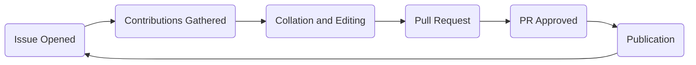

# SR(A)WN

The Student Robotics (Almost) Weekly Newsletter (SR(A)WN) is a semi-regular newsletter written by volunteers for volunteers.

## Availablility

SR(A)WN can be consumed electronically from several places:

- Join the `#srawn` channel on [Slack](https://app.slack.com/client/T0EEPF1LH/C01GBT8NMSN) _recommended_
- Join the `srawn` mailing list on [Google Groups](https://groups.google.com/g/srawn)
- Read historical issues on the [SR(A)WN Archive](https://studentrobotics.org/srawn)
- Subscribe to the [SR(A)WN RSS Feed](https://studentrobotics.org/srawn/rss.xml)

The frequency of SR(A)WN issues is dependent on how much is going on within SR. In general there is an aim to wait until there is a good amount of interesting content.

## Production Process

The production process for SR(A)WN as of SR2021 follows the lifecycle in the following diagram:

Production is managed by the editor for a given issue of SR(A)WN. The editor is identifiable as the author of the GitHub Issue for that issue of SR(A)WN. There is currently not a process for assigning an editor and the position is currently held on a de-facto basis.

Production is performed on the [SR(A)WN GitHub repository][srawn-github].

### Managing Issue

The first stage in the production of an issue of SR(A)WN is the creation of the *managing issue* on [GitHub][srawn-github].

The *managing issue* should be based on the [submission thread template](https://github.com/srobo/srawn/blob/master/.github/ISSUE_TEMPLATE/submission-thread.md). The dates, times and issue numbering in the template should be updated appropriately. The editor will decide on a deadline for submissions for that issue, which is included in the template.

Contributions from volunteers should be submitted as comments on the *managing issue* before the deadline.

### Editing

SR(A)WN is broadly organised into 3 sections:

- Notices
    - Important notices regarding SR(A)WN. e.g update in place of publication
    - Rarely used
- Headlines
    - Maximum of 3 very important news items.
- News
    - News from around SR. Organised by category or (sub) team.

Content is collated from the *managing issue* and any news that the editor thinks is worth sharing.

The draft issue is submitted as a Pull Request to the [SR(A)WN GitHub repository][srawn-github].

### Publication

There are two stages to publication:

- Merging the PR
    - This should close the *managing issue*
    - The Archive and RSS Feed will update automatically.
    - The Slack channel will post automatically.
- Email the `srawn` Google Group.
    - This email should contain the HTML from the archive.
    - The subject line should be: `[SRAWN] SR20XX Issue XX`, with the year and issue number appropriately filled in.
    - The email should be sent from the editor's SR email address.

[srawn-github]: https://github.com/srobo/srawn